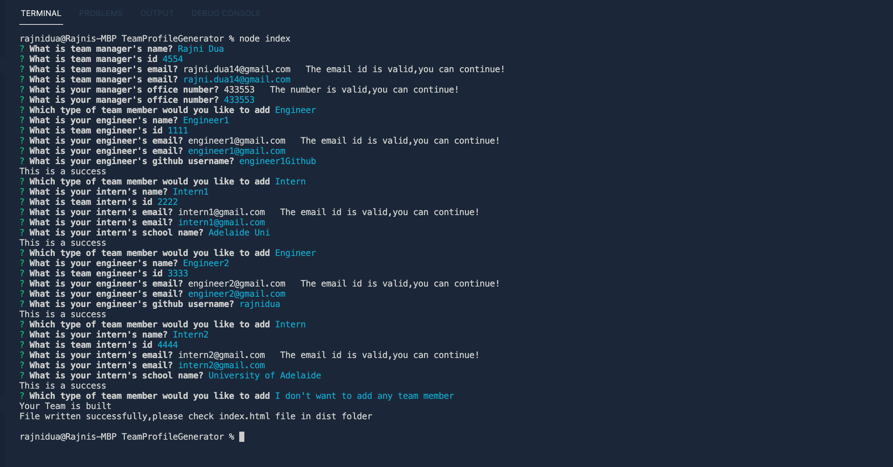
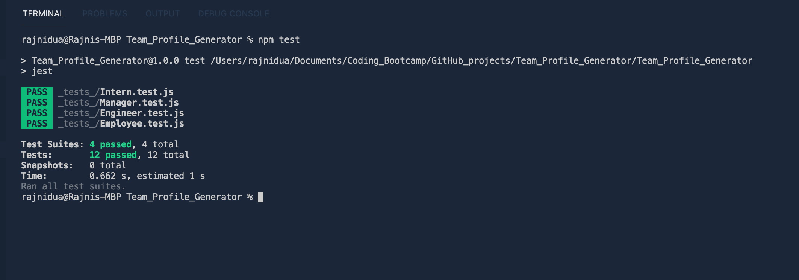
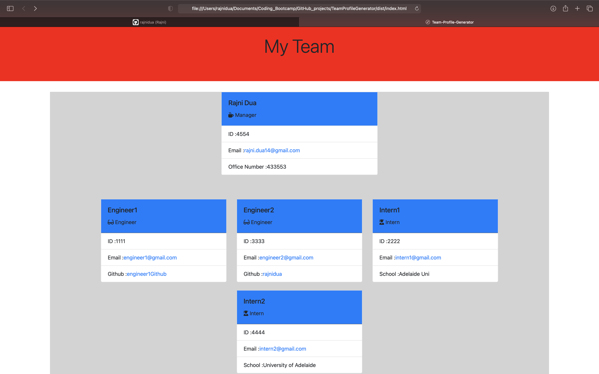

# TeamProfileGenerator
# Team_Profile_Generator
  


 
  ## Table of contents
  - [Description](#Description)
  - [Video link](#Video)
  - [Screenshots](#Screenshot)
  - [Installation](#Installation)
  - [Usage](#Usage)
  - [Testing](#Testing)
  - [Contributing](#Contributing)
  - [Questions](#Questions)
  - [License](#License)

  ## Description
  Node.js command-line application that takes in information about employees on a software engineering team, then generates an HTML webpage that displays summaries for each person.

  GIVEN a command-line application that accepts user input
WHEN I am prompted for my team members and their information
THEN an HTML file is generated that displays a nicely formatted team roster based on user input
WHEN I click on an email address in the HTML
THEN my default email program opens and populates the TO field of the email with the address
WHEN I click on the GitHub username
THEN that GitHub profile opens in a new tab
WHEN I start the application
THEN I am prompted to enter the team manager’s name, employee ID, email address, and office number
WHEN I enter the team manager’s name, employee ID, email address, and office number
THEN I am presented with a menu with the option to add an engineer or an intern or to finish building my team
WHEN I select the engineer option
THEN I am prompted to enter the engineer’s name, ID, email, and GitHub username, and I am taken back to the menu
WHEN I select the intern option
THEN I am prompted to enter the intern’s name, ID, email, and school, and I am taken back to the menu
WHEN I decide to finish building my team
THEN I exit the application, and the HTML is generated

## Video

(https://drive.google.com/file/d/1rBJ4OyWYs5vpYH89-ucRC6-W5_WL8nTN/view?usp=sharing)


## Screenshot

[]

[]

[]


  ## Installation
  ```md
  node js
  npm install
  npm install inquirer.js
  ```

  ## Usage
  Run the application using node index command.
  Answer the series of prompts to build your team.
  Check your built team by rendering the newly created/written index.html file in browser.

  
  ## Testing
  This repository uses test driven development, Please test using npm install. Also, after you answer all the prompts, the final team that is built is written to the index.html file , that could be testing by rendering it in the browser.

  ## Contributing
  Rajni Dua

  ## Questions
  For any further questions, reachout to me at :
  - Github: [rajnidua](https://github.com/rajnidua)
  - Email: rajni.dua14@gmail.com

## License
    

  
&copy;  2021  Rajni Dua
    
*Licensed under [MIT](./license)*
